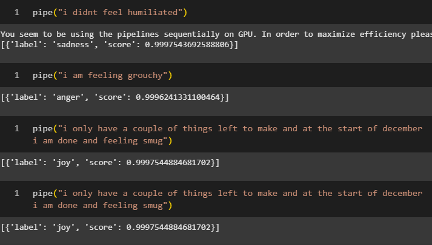

# Sentiment Analysis with Fine-Tuned BERT

This project demonstrates multi-class sentiment analysis using a fine-tuned BERT model trained on Twitter sentiment data.

## Model Output Examples

### Class Labels

```
{0: 'sadness', 2: 'love', 4: 'fear', 3: 'anger', 5: 'surprise', 1: 'joy'}
```
### Screenshots

Below are some sample screenshots showing the model in action:




---

This model was fine-tuned using HuggingFace's `transformers` library and a BERT base uncased model. The pipeline predicts one of the six emotion categories (`sadness`, `love`, `fear`, `anger`, `surprise`, `joy`) for a given input sentence.
