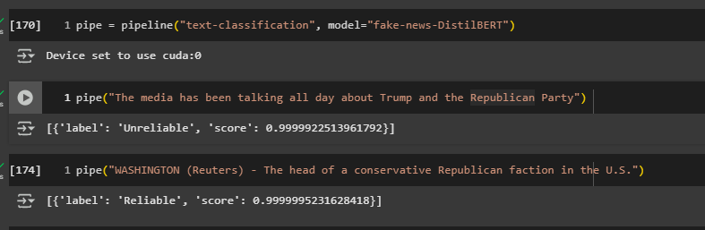

# Fake News Detection with Fine-Tuned DistilBERT

This project demonstrates binary text classification using a fine-tuned **DistilBERT** model to detect whether a news article is **unreliable** or **reliable**.
Kaggle dataset link: https://www.kaggle.com/datasets/anupampaul005/fake-news-dataset <br>

[](https://colab.research.google.com/drive/10iK0V3eDzs80aVXkjzYa0Q3aEy0_alLE?usp=sharing)

## Model Output Examples

### Class Labels

```
{0: 'Reliable', 1: 'Unreliable'}
```

### Screenshots

Below are some sample screenshots showing the model in action:



---

This model was fine-tuned using HuggingFace's `transformers` library and the **DistilBERT base uncased** model.
