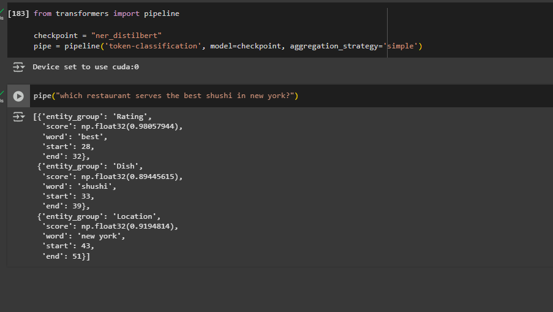

# Fake News Detection with Fine-Tuned DistilBERT

This project demonstrates Named Entity Recognition using a fine-tuned **DistilBERT** model on a restaurant dataset. 
Dataset Link: https://sls.csail.mit.edu/downloads/restaurant/

## Model Output Examples

Below are some sample screenshots showing the model in action:

---

This model was fine-tuned using HuggingFace's `transformers` library and the **DistilBERT base uncased** model.
