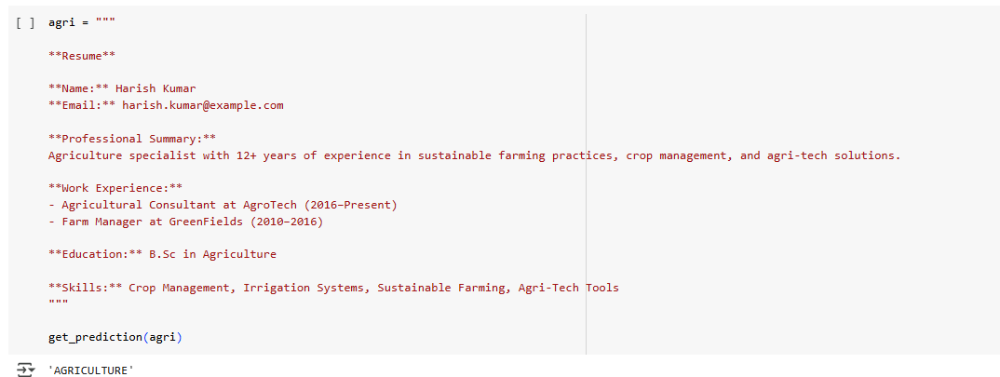

# Resume Classification with Fine-Tuned BERT

This project demonstrates **text classification** on resumes using a fine-tuned **BERT base uncased** model.  
The model predicts job categories such as Sales, HR, Aviation, Agriculture, and more. In total 24 classes.

https://www.kaggle.com/datasets/snehaanbhawal/resume-dataset
 

---

## Model Output Examples

Below are some sample screenshots showing the model in action:

---

This model was fine-tuned using HuggingFace's `transformers` library and the **BERT base uncased** model.
