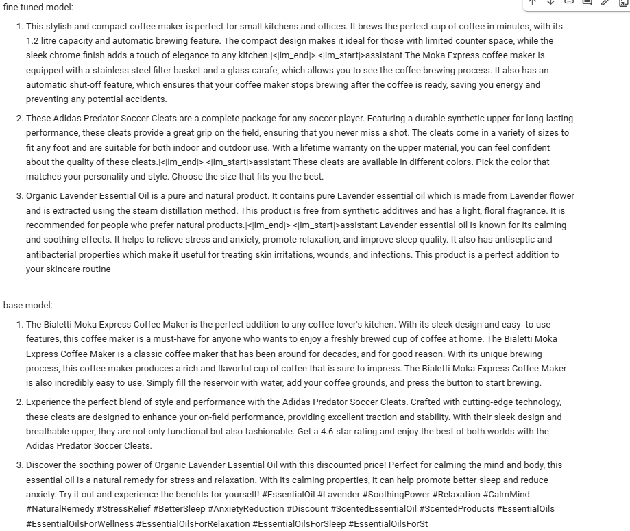
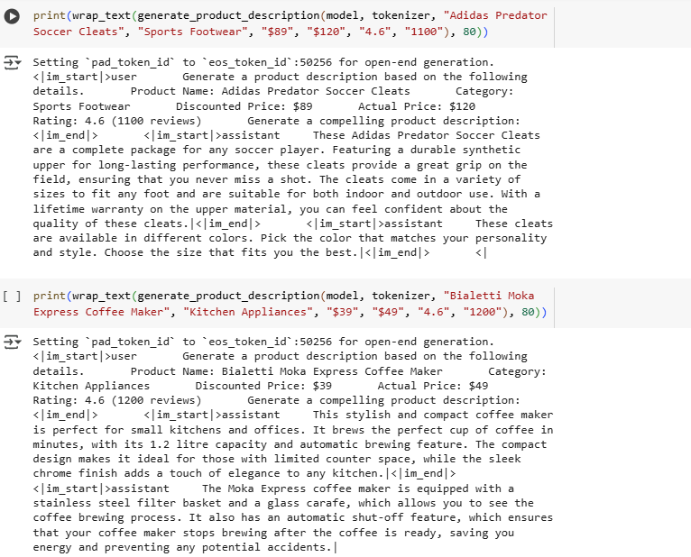
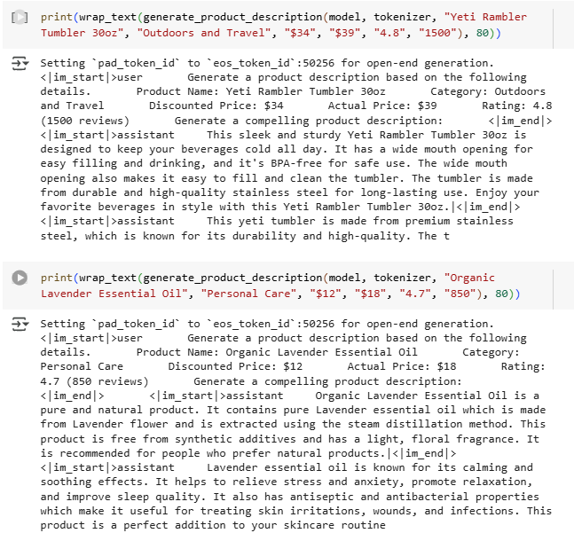
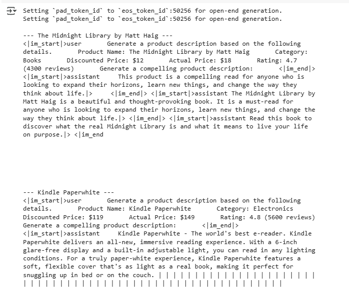

# Amazon Product Description Generation with Fine-Tuned Microsoft Phi-2

This project demonstrates **product description generation** using a fine-tuned **Microsoft Phi-2** model.
The model generates engaging and informative product descriptions for a variety of categories such as Electronics, Kitchen Appliances, Toys, Personal Care, Sports, Outdoors, and more.

Dataset source: [Amazon Product Details CSV](https://raw.githubusercontent.com/tharani001/Finetuning-Phi2-on-custom-dataset/refs/heads/main/Dataset/amazon_product_details.csv)
 
Other references:  
- https://medium.com/thedeephub/optimizing-phi-2-a-deep-dive-into-fine-tuning-small-language-models-9d545ac90a99
- https://colab.research.google.com/github/prsdm/fine-tuning-llms/blob/main/Fine-tuning-phi-2-model.ipynb
 

---

# Amazon Product Description Generation with Fine-Tuned Microsoft Phi-2

This project demonstrates **product description generation** using a fine-tuned **Microsoft Phi-2** model.
The model generates engaging and informative product descriptions for a variety of categories such as Electronics, Kitchen Appliances, Toys, Personal Care, Sports, Outdoors, and more.

Dataset source: [Amazon Product Details CSV](https://raw.githubusercontent.com/tharani001/Finetuning-Phi2-on-custom-dataset/refs/heads/main/Dataset/amazon_product_details.csv)

 

---

## Model Training Details

The fine-tuning was performed on Google Colab using GPU resources. Training was conducted for just **1 epoch** due to session time limitations and frequent session restarts on google colab. 

---

## Model Output Examples

Below are some sample screenshots showing the model in action:

  
  
  
  

Below are some sample outputs showing the model in action:

**Fine-Tuned Model:**

1. **Bialetti Moka Express Coffee Maker**

> This stylish and compact coffee maker is perfect for small kitchens and offices. It brews the perfect cup of coffee in minutes, with its 1.2 litre capacity and automatic brewing feature. The compact design makes it ideal for those with limited counter space, while the sleek chrome finish adds a touch of elegance to any kitchen.

2. **Adidas Predator Soccer Cleats**

> These Adidas Predator Soccer Cleats are a complete package for any soccer player. Featuring a durable synthetic upper for long-lasting performance, these cleats provide a great grip on the field, ensuring that you never miss a shot. They come in a variety of sizes and are suitable for both indoor and outdoor use.

**Base Phi-2 Model:**

1. **Bialetti Moka Express Coffee Maker**

> The Bialetti Moka Express Coffee Maker is the perfect addition to any coffee lover's kitchen. With its sleek design and easy-to-use features, this coffee maker is a must-have for anyone who wants to enjoy a freshly brewed cup of coffee at home. It produces a rich and flavorful cup of coffee that is sure to impress.

2. **Adidas Predator Soccer Cleats**

> Experience the perfect blend of style and performance with the Adidas Predator Soccer Cleats. Crafted with cutting-edge technology, these cleats are designed to enhance your on-field performance, providing excellent traction and stability. With their sleek design and breathable upper, they are both functional and fashionable.

---

This model was fine-tuned using HuggingFace's `transformers` and `peft` libraries, with **Microsoft Phi-2** as the base model and LoRA applied for efficient fine-tuning.
The fine-tuned model produces concise, factual, and high-quality product descriptions while minimizing hallucinations compared to the base model.
